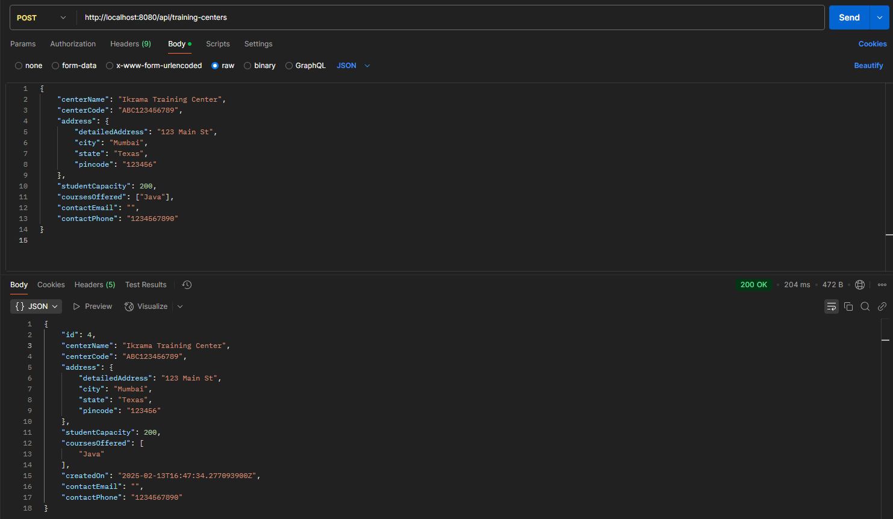
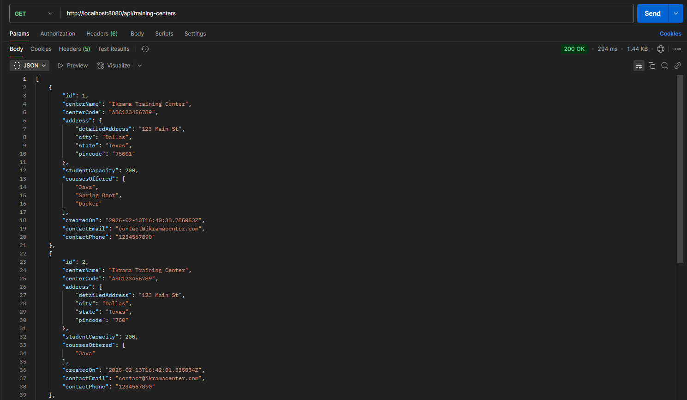
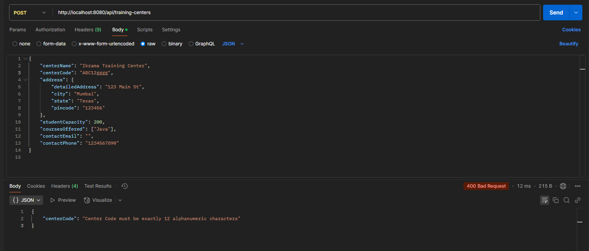

# Traini8 - Backend for Govt-funded Training Centers

This repository contains the backend code for a registry of Govt-funded training centers. The MVP includes two APIs for creating and fetching training center data. It is built using **Spring Boot** and **MySQL**.

## Prerequisites

Before you begin, ensure you have the following installed:

- **Java 17 or above**: Required for running the Spring Boot application.
- **MySQL**: For database setup.
- **Maven**: For managing dependencies and running the application.
- **Git**: To clone the repository.

## Getting Started

### 1. Clone the Repository

Clone this repository to your local machine using the following command:

```bash
git clone https://github.com/ikrama-01/Backend_Traini8_Ikrama.git

```

### 2. Configure MySQL Database
Start MySQL Server

Create a new database in MySQL for the project:
```bash
CREATE DATABASE traini8_db;
```

Update the application.properties file in src/main/resources to match your MySQL configuration.

Replace YourPasssword with your SQL password and username with your SQL username if set or else root by default.
```bash
spring.datasource.url=jdbc:mysql://localhost:3306/traini8_db
spring.datasource.username=root
spring.datasource.password=YourPassword
spring.datasource.driver-class-name=com.mysql.cj.jdbc.Driver
spring.jpa.database-platform=org.hibernate.dialect.MySQL8Dialect
spring.jpa.hibernate.ddl-auto=update
```
### 3. Run the Application
Navigate to the project directory and run the application using Maven from Terminal.
```bash
mvn clean install
mvn spring-boot:run
```
The application will start on http://localhost:8080.

### 4. Testing the APIs
You can test the APIs using any REST client (e.g., Postman) or through curl.

POST - Create a New Training Center

Endpoint: http://localhost:8080/api/training-centers

Method: POST

Header: Content-Type: application/json

Request Body:
```
{
    "centerName": "Ikrama Training Center",
    "centerCode": "ABC123456789",
    "address": {
        "detailedAddress": "123 Main St",
        "city": "Dallas",
        "state": "Texas",
        "pincode": "123456"
    },
    "studentCapacity": 200,
    "coursesOffered": ["Java", "Spring Boot", "Docker"],
    "contactEmail": "contact@ikramacenter.com",
    "contactPhone": "1234567890"
}
```
Response (on success):
```
{
    "id": 1,
    "centerName": "Ikrama Training Center",
    "centerCode": "ABC123456789",
    "address": {
        "detailedAddress": "123 Main St",
        "city": "Dallas",
        "state": "Texas",
        "pincode": "123456"
    },
    "studentCapacity": 200,
    "coursesOffered": ["Java", "Spring Boot", "Docker"],
    "contactEmail": "contact@ikramacenter.com",
    "contactPhone": "1234567890",
    "createdOn": 1627483200
}
```
GET - List All Training Centers

Endpoint: http://localhost:8080/api/training-centers

Method: GET

Response (on success):
```
[
    {
        "id": 1,
        "centerName": "Ikrama Training Center",
        "centerCode": "ABC123456789",
        "address": {
            "detailedAddress": "123 Main St",
            "city": "Dallas",
            "state": "Texas",
            "pincode": "123456"
        },
        "studentCapacity": 200,
        "coursesOffered": ["Java", "Spring Boot", "Docker"],
        "contactEmail": "contact@ikramacenter.com",
        "contactPhone": "1234567890",
        "createdOn": 1627483200
    }
]
```
### Handling Validation Errors

If you submit data that violates the validation constraints (e.g., missing required fields, invalid email format, etc.), the API will return an appropriate error message.

Example error message for missing centerName:
```
{
    "centerName": "Center Name is required"
}
```
# Demo
Post request demo with successful response


Get request demo with successful response


Post request with errors (JSON fromat)

